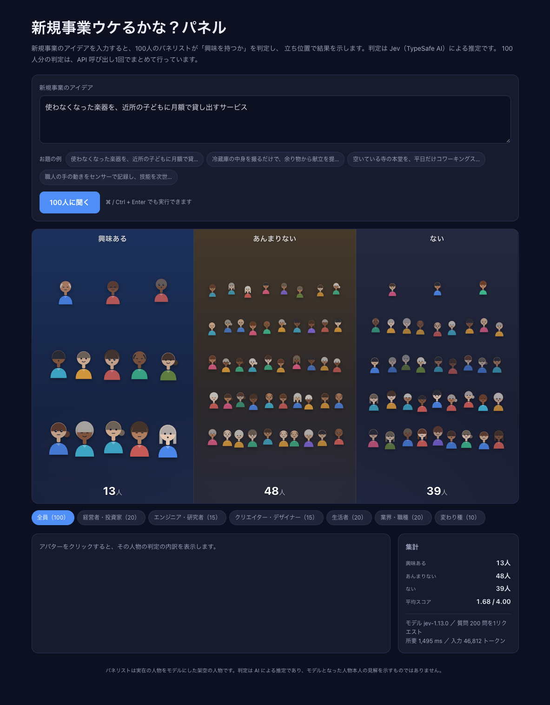
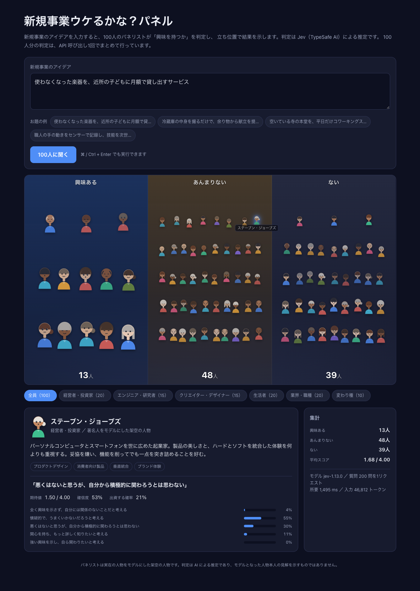

# 新規事業ウケるかな？パネル

新規事業のアイデアを入力すると、**100人のパネリストがそれぞれ「興味を持つか」を判定し、
興味の度合いごとの陣地にアバターが立ち並ぶ**Webアプリです。

判定には **Jev（[TypeSafe AI](https://typesafe.ai/)）** を使用します。LLM（文章生成モデル）は使いません。



アバターをクリックすると、その人物のプロフィールと判定の内訳（期待値・確信度・確率分布）が表示されます。



---

## 仕組み

1. ブラウザからアイデア文を `POST /api/judge` に送信
2. サーバー側（Route Handler）で、100人分の「興味の度合い」＋「自分の資金を出すか」= **計200問を Jev に1リクエストで**投げる
3. 返ってきたスコアを3つの陣地（興味ある／あんまりない／ない）に振り分け、期待値に応じた立ち位置で描画

Jev は1リクエスト内の全質問を並列に評価するため、200問でも**実測 1.5〜1.6 秒**で返ります。

パネリストは**実在の人物をモデルにした架空の人物43名**と、**業界・職種のアーキタイプ57名**で構成しています。
名前は元の人物と分かる程度にもじった架空の名前です（例: 「ステーブン・ジョーブズ」）。
判定は AI による推定であり、モデルとなった人物本人の見解を示すものではありません。

## セットアップ

### 必要なもの

- Node.js 20 以上（[mise](https://mise.jdx.dev/) を使う場合はバージョンを固定済み）
- TypeSafe AI の API キー（無くても後述の**モックモード**で動きます）

```bash
mise install          # mise.toml に従って Node.js を用意する
npm ci
```

mise を使わない場合は、Node.js 20 以上を各自の方法で用意してください。

### API キー

リポジトリ直下に `.env.local` を作り、キーを書きます。

```bash
cp .env.example .env.local
```

```
TYPESAFE_API_KEY=（TypeSafe AI の API キー）
```

- `.env.local` は `.gitignore` 済みです。
- **`NEXT_PUBLIC_` を付けないでください。** 付けるとキーがブラウザへ配信されます。
  キーはサーバー側の Route Handler からのみ参照します。
- Vercel へデプロイする場合は、同じ変数名を Environment Variables に登録してください。

### 起動

```bash
npm run dev     # http://localhost:3000
```

### モックモード

`TYPESAFE_API_KEY` が未設定の場合は**モックモードで起動します。**
アイデア文とパネリストの関心領域の重なりから疑似的なスコアを生成するため、
キーが無くても UI とアニメーションを確認できます。画面上部に警告が表示されます。

## スクリプト

| コマンド | 内容 |
| --- | --- |
| `npm run dev` | 開発サーバー |
| `npm run build` | 本番ビルド |
| `npm start` | 本番サーバー |
| `npm run typecheck` | 型検査（`tsc --noEmit`） |
| `npm run lint` | Lint（Biome） |
| `npm run format` | 整形（Biome） |
| `npm run check` | Lint + 整形 + import 整理のチェック |
| `npm run check:fix` | 上記を自動修正 |

## 技術スタック

| レイヤー | 採用技術 |
| --- | --- |
| フレームワーク | Next.js 16（App Router / Turbopack） |
| UI | React 19 |
| 言語 | TypeScript 7（`strict`） |
| 判定 | `@typesafe-ai/sdk`（Jev） |
| Lint / Format | Biome 2 |
| Node.js | mise で 24 系に固定 |

スタイルは素の CSS のみ、アバターは `id` から決定的に生成するインライン SVG で、
外部アセットや画像ファイルには依存していません。

## 構成

```
app/
├── page.tsx              画面全体の状態管理（"use client"）
├── layout.tsx
├── globals.css
└── api/judge/route.ts    Jev 呼び出しの Route Handler（APIキーはここだけ）
components/
├── VotingFloor.tsx       3つの陣地とアバターの配置
└── Avatar.tsx            SVG アバター
lib/
├── jev.ts                Jev 呼び出しとモックモード
├── panel.ts              型・ルーブリック・陣地の判定
└── avatar.ts             seed からアバターのパーツを決定
data/
└── panelists.json        パネリスト100人の定義
docs/
└── screenshot-*.png      スクリーンショット
```

## パネリストを差し替える

`data/panelists.json` を編集するだけで、性格の異なるパネルを作れます。

```jsonc
{
  "id": "p001",
  "name": "ステーブン・ジョーブズ",   // または「SaaSスタートアップのCTO」
  "kind": "figure",                  // "figure" | "archetype"
  "category": "経営者・投資家",
  "profile": "パーソナルコンピュータとスマートフォンを世に広めた起業家。…",
  "interests": ["プロダクトデザイン", "消費者向け製品", "垂直統合"]
}
```

Jev には**名前だけでなく `profile` と `interests` を必ず一緒に渡しています。**
名前の知識に依存しないため、架空の人物でもアーキタイプでも同じコードで動作し、
判定の根拠を設計者側で制御できます。

> `data/panelists.json` は1行1件の形式を保つため、Biome の整形対象から除外しています。

## ライセンス

[MIT](LICENSE)
