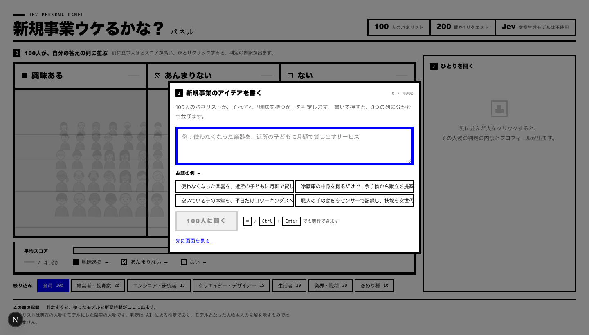

# 新規事業ウケるかな？パネル

新規事業のアイデアを入力すると、**100人のパネリストがそれぞれ「興味を持つか」を判定し、
興味の度合いごとの陣地にアバターが立ち並ぶ**Webアプリです。

判定には **Jev（[TypeSafe AI](https://typesafe.ai/)）** を使用します。LLM（文章生成モデル）は使いません。



最初は入力欄だけが画面の中央に出ます。「100人に聞く」を押すと、
**入力欄がそのまま右の定位置へ飛んでいき**、100人が3つの列に分かれます。
次からは入力欄がどこにあるか分かっているので、迷いません。


列に並んだ人をクリックすると、右側にその人物の判定の内訳（期待値・確信度・確率分布）と
プロフィールが出ます。**書く・並ぶ・ひとりを開く、が1画面で完結します。**


---

## 仕組み

1. ブラウザからアイデア文を `POST /api/judge` に送信
2. サーバー側（Route Handler）で、100人分の「興味の度合い」＋「自分の資金を出すか」= **計200問を Jev に1リクエストで**投げる
3. 返ってきたスコアを3つの陣地（興味ある／あんまりない／ない）に振り分け、期待値に応じた立ち位置で描画

Jev は1リクエスト内の全質問を並列に評価するため、200問でも**実測 1.5〜1.6 秒**で返ります。

パネリストは**実在の人物をモデルにした架空の人物43名**と、**業界・職種のアーキタイプ57名**で構成しています。
名前は元の人物と分かる程度にもじった架空の名前です（例: 「ステーブン・ジョーブズ」）。
判定は AI による推定であり、モデルとなった人物本人の見解を示すものではありません。

## セットアップ

### 必要なもの

- Node.js 20 以上（[mise](https://mise.jdx.dev/) を使う場合はバージョンを固定済み）
- TypeSafe AI の API キー（無くても後述の**モックモード**で動きます）

```bash
mise install          # mise.toml に従って Node.js を用意する
npm ci
```

mise を使わない場合は、Node.js 20 以上を各自の方法で用意してください。

### API キー

リポジトリ直下に `.env.local` を作り、キーを書きます。

```bash
cp .env.example .env.local
```

```
TYPESAFE_API_KEY=（TypeSafe AI の API キー）
```

- `.env.local` は `.gitignore` 済みです。
- **`NEXT_PUBLIC_` を付けないでください。** 付けるとキーがブラウザへ配信されます。
  キーはサーバー側の Route Handler からのみ参照します。

### 資格情報の優先順位

`lib/jev.ts` は、次の順で見つかったものを使います。宛先とモデル ID の差し替えも
そこで行うので、**どれを使うかは設定だけで決まり、コードは変わりません。**

| 順 | 資格情報 | 経路 | 備考 |
| --- | --- | --- | --- |
| 1 | `AI_GATEWAY_API_KEY` | AI Gateway | |
| 2 | `TYPESAFE_API_KEY` | TypeSafe へ直接 | |
| 3 | Vercel の OIDC トークン | AI Gateway | **秘密をどこにも置かない。設定不要** |
| — | なし | — | モックモード |

明示した鍵を OIDC より先に見るのは、環境変数を足しただけで経路が黙って
変わらないようにするためです。**OIDC を使うときは、鍵のほうを消します。**

OIDC を使うと、Vercel が短命トークンを自動発行するため、長期間有効な秘密を
environment variables に置かずに済みます。トークンは本番ではリクエストの
`x-vercel-oidc-token` ヘッダーから、ローカルでは `vercel env pull` が書いた
`VERCEL_OIDC_TOKEN` から取ります（[@vercel/oidc](https://www.npmjs.com/package/@vercel/oidc)）。

> **AI Gateway の無料枠は、いまのところ安定しません。** 実測で10回中3回ほど
> 上流混雑（503 / 429）で失敗します。自分の TypeSafe キーで直接叩く場合は
> 12回中12回成功・約700msでした。無料枠は共有の資格情報を使うためで、
> 自分の枠を使う BYOK は有料枠（クレジット購入）が必要です。

### 起動

```bash
npm run dev     # http://localhost:3000
```

### モックモード

`TYPESAFE_API_KEY` が未設定の場合は**モックモードで起動します。**
アイデア文とパネリストの関心領域の重なりから疑似的なスコアを生成するため、
キーが無くても UI とアニメーションを確認できます。画面上部に警告が表示されます。

## Vercel へデプロイする

```bash
npm i -g vercel
vercel        # プレビュー環境へ
vercel --prod # 本番へ
```

GitHub と連携する場合は、Vercel のダッシュボードでリポジトリを Import するだけです。
Next.js として自動検出されるので、ビルド設定の変更は要りません。

`TYPESAFE_API_KEY` を登録すれば TypeSafe へ直接つなぎます。安定して速いのはこちらです。

秘密を置きたくない場合は、**環境変数を何も登録せず**に OIDC へ任せます
（Project → Settings → Security → Secure Backend Access が有効であること）。
ただし上の注意書きのとおり、無料枠では失敗が混ざります。

`/api/judge` は誰でも叩ける公開エンドポイントなので、
**AI Gateway 側でプロジェクトに予算上限（Budget）を設定してください。**
鍵を盗まれる経路を塞いでも、呼ばれる量は別に抑える必要があります。

| 項目 | 値 | 備考 |
| --- | --- | --- |
| Node.js | 24.x | `package.json` の `engines.node` で指定 |
| 関数の実行時間 | 60秒 | `app/api/judge/route.ts` の `maxDuration`。Hobby の上限は300秒 |
| ランタイム | Node.js | SDK が Node.js 20以上を要求するため、Edge では動きません |

判定は 1.5〜1.6 秒で返るので、60秒は十分な余裕を見た値です。

経路の確認は、画面下部「この回の記録」のモデル名で行えます。
`typesafe-ai/jev` なら Gateway 経由、`jev-1.13.0` なら TypeSafe へ直接です。

## スクリプト

| コマンド | 内容 |
| --- | --- |
| `npm run dev` | 開発サーバー |
| `npm run build` | 本番ビルド |
| `npm start` | 本番サーバー |
| `npm run typecheck` | 型検査（`tsc --noEmit`） |
| `npm run lint` | Lint（Biome） |
| `npm run format` | 整形（Biome） |
| `npm run check` | Lint + 整形 + import 整理のチェック |
| `npm run check:fix` | 上記を自動修正 |

## 技術スタック

| レイヤー | 採用技術 |
| --- | --- |
| フレームワーク | Next.js 16（App Router / Turbopack） |
| UI | React 19 |
| 言語 | TypeScript 7（`strict`） |
| 判定 | `@typesafe-ai/sdk`（Jev） |
| Lint / Format | Biome 2 |
| Node.js | mise で 24 系に固定 |

スタイルは素の CSS のみ、アバターは `id` から決定的に生成するインライン SVG で、
Web フォントを含め外部アセットや画像ファイルには依存していません。

## デザイン

見た目は [DESIGN.md](https://designmd.ai/) の
[RawBlock](https://designmd.ai/chef/rawblock) を下敷きにしたブルータリズムです。
角丸なし・影なし・純粋な黒と白で、階層は罫線の太さ（1 / 3 / 5px）と大きさの差だけで作ります。
RawBlock が指定する Archivo Black / Work Sans / Space Mono は和文を持たないため、
外部アセット非依存を保つ目的で、同じ役割の OS 標準フォント（太いゴシック・本文ゴシック・等幅）
に置き換えています。

**3つの陣地には色を使っていません。** 「塗り／斜線／白抜き」というインクの量の差で
順序を表すため、色覚特性や白黒印刷に影響されません。

色は2つだけ使います。**パネリスト本人（アバター）**と、**青 `#0000FF`** です。
青は「押せる・いま選ばれている」ものにしか使いません（実行ボタン、選択中の人、
有効な絞り込み、フォーカス）。素の HTML のリンク色そのものなので、
ブルータリズムの語彙から外れずに、操作できるものだけを浮かび上がらせられます。

陣地は左右の境界が垂直な「列」で、列名と人数はその列の真上に、列と同じ幅で置いています。
列の中では、スコアの高い人ほど手前に立ちます。人の大きさと間隔はどの列でも同じで、
違うのは「列がどこまで奥に伸びているか」だけ ― 列の厚みがそのまま人数として読めます
（`lib/stage.ts`）。

### 何をすれば何が起きるか

手を動かす場所には **①②③ の番号**を振っています（① アイデアを書く → ②
100人が列に並ぶ → ③ ひとりを開く）。番号は位置に依存せず順序を作れるので、
入力欄が右にあっても読む順が崩れません。

判定前の舞台には、**結果らしきものを出しません。** 以前は100人が列に分かれて
立っていたため、初見では「もう終わった結果が壊れている画面」に見えていました。
いまは人を薄く伏せ、判定中は「100人に聞いています…」を重ねて出します。

初回の導線は、入力欄そのものが担います。読み込み直後は入力欄だけが画面の中央に
出て（`role="dialog"`、背面は `inert`）、実行すると FLIP で右の定位置へ移動します。
**「どこに書くのか」と「その欄が普段どこにあるのか」を、一度の動きで同時に教える**
狙いです。実行せずに閉じたい場合は Escape か「先に画面を見る」で、そのときだけ
舞台に「まだ誰も並んでいません」と出ます。`prefers-reduced-motion` では移動を
アニメーションさせません。

### 1画面に収める

縦に読み進める構成ではなく、**幅 1040px・高さ 660px 以上の画面ではページ全体を
`100dvh` に固定**し、左に舞台、右に入力欄と詳細を置いています。余った高さはすべて舞台が
受け取り、詳細が長いときはその中だけがスクロールします（入力欄は常に見えたまま）。
これより小さい画面では、入力 → 舞台 → 詳細の順に積み上がる通常の流れに戻ります。

## 構成

```
app/
├── page.tsx              画面全体の状態管理（"use client"）
├── layout.tsx
├── globals.css
└── api/judge/route.ts    Jev 呼び出しの Route Handler（APIキーはここだけ）
components/
├── VotingFloor.tsx       舞台の照明・3つの陣地・アバターの配置
└── Avatar.tsx            SVG アバター
lib/
├── jev.ts                Jev 呼び出しとモックモード
├── panel.ts              型・ルーブリック・陣地の判定
├── stage.ts              舞台の遠近法（陣地の台形と立ち位置を同じ式から作る）
└── avatar.ts             seed からアバターのパーツを決定
data/
└── panelists.json        パネリスト100人の定義
docs/
└── screenshot-*.png      スクリーンショット（最初の画面・判定結果・詳細）
```

## パネリストを差し替える

`data/panelists.json` を編集するだけで、性格の異なるパネルを作れます。

```jsonc
{
  "id": "p001",
  "name": "ステーブン・ジョーブズ",   // または「SaaSスタートアップのCTO」
  "kind": "figure",                  // "figure" | "archetype"
  "category": "経営者・投資家",
  "profile": "パーソナルコンピュータとスマートフォンを世に広めた起業家。…",
  "interests": ["プロダクトデザイン", "消費者向け製品", "垂直統合"]
}
```

Jev には**名前だけでなく `profile` と `interests` を必ず一緒に渡しています。**
名前の知識に依存しないため、架空の人物でもアーキタイプでも同じコードで動作し、
判定の根拠を設計者側で制御できます。

> `data/panelists.json` は1行1件の形式を保つため、Biome の整形対象から除外しています。

## ライセンス

[MIT](LICENSE)
